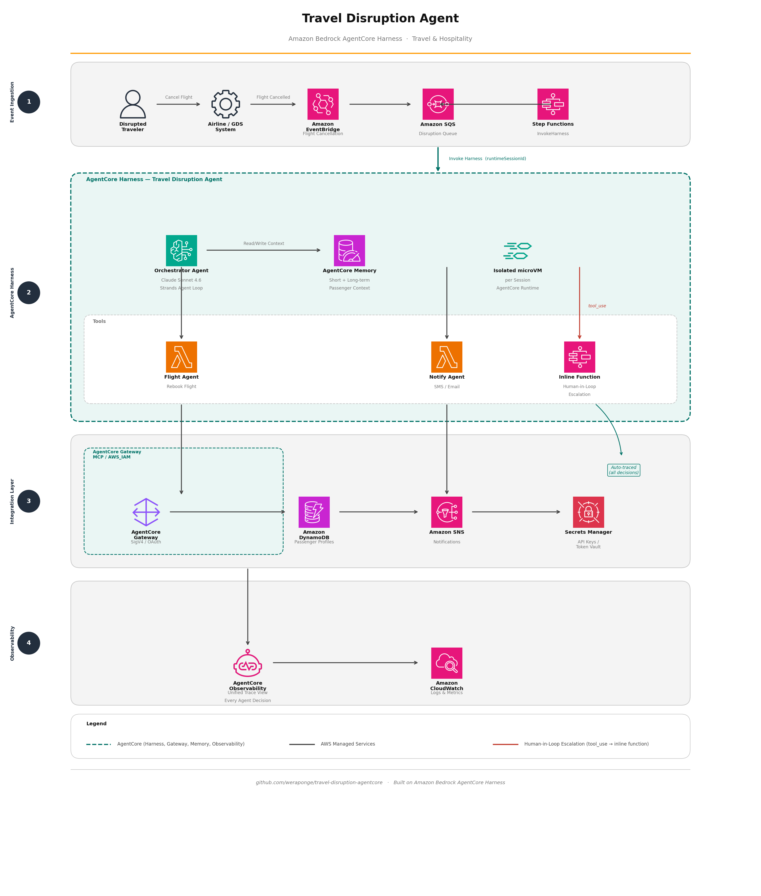

# ✈️ Travel Disruption Agent — Amazon Bedrock AgentCore Harness

[](https://aws.amazon.com/bedrock/agentcore/)
[](https://aws.amazon.com/cdk/)
[](https://www.python.org/)
[](LICENSE)

> Every day, 50,000+ flights are cancelled globally. Airlines spend billions on manual rebooking. This demo shows how to recover disrupted passengers autonomously — in seconds, not hours — using Amazon Bedrock AgentCore Harness.

---

## What is AgentCore Harness?

AgentCore Harness is a managed agent runtime from AWS. You declare **what** the agent does (model, tools, memory, instructions) and the harness handles everything else: the orchestration loop, tool invocation, session isolation, memory, and observability. No container to manage. No orchestration code to write.

This project uses it to build a travel disruption recovery agent that:

- 🔁 **Rebooks flights** via a Lambda-backed tool exposed through AgentCore Gateway
- 📱 **Notifies travelers** via SMS/email with confirmed rebooking details
- 🧠 **Remembers context** — follow-up questions are answered from AgentCore Memory with no re-sending history
- 🚨 **Escalates edge cases** — unaccompanied minors trigger a human-in-the-loop inline function that pauses the agent
- 🔀 **Switches models per invocation** — Claude Haiku for tool demos, Claude Sonnet for escalation

---

## Architecture



> **Demo scope:** This repo deploys the Flight Agent and Notify Agent (Path B). Hotel Agent, Compensation Agent, EventBridge, SQS, and SNS triggers follow the identical CDK + Lambda pattern and can be added without changing the harness configuration.

To regenerate the diagram:
```bash
python3 generate_diagram.py
```

---

## AgentCore Harness features demonstrated

| Feature | How it's used in this demo |
|---|---|
| **Configuration-only agent** | Entire agent defined via `create_harness` — no orchestration code |
| **AgentCore Gateway** | 2 Lambda tools exposed as MCP tools with AWS_IAM inbound auth |
| **AgentCore Memory** | Passenger context persists across turns and microVM restarts |
| **Inline function** | `escalate_to_agent` pauses the agent for human review |
| **Per-invocation model switching** | Haiku for tool demos, Sonnet for escalation — memory carries over |
| **`allowedTools` scoping** | Restricts model to exactly 3 tools, reducing token overhead |
| **Isolated microVM per session** | Each passenger recovery is fully sandboxed |

---

## Quick start

### Prerequisites

- AWS CLI 2.x with credentials configured
- Node.js 20+
- Python 3.10+
- Access to `us.anthropic.claude-sonnet-4-6` in Amazon Bedrock (`us-east-1`)

### 1. Deploy

```bash
cd cdk-demo

# First time only — bootstrap CDK (once per account/region)
npx cdk bootstrap

# Deploy all resources (~2 min)
./deploy.sh
```

`deploy.sh` creates the full stack and prints the harness ARN and a ready-to-run demo command at the end.

### 2. Run the demo

```bash
# Set up Python environment
python3 -m venv .venv && .venv/bin/pip install boto3

# Run all three demo scenarios
.venv/bin/python demo.py \
  --region us-east-1 \
  --skip-create \
  --harness-arn "<HARNESS_ARN_FROM_DEPLOY_OUTPUT>" \
  --no-cleanup
```

### 3. Destroy

```bash
cd cdk-demo
./destroy.sh
```

---

## Demo scenarios

### Demo 1 — Standard disruption recovery
Flight AA123 (JFK→LAX) is cancelled. The agent calls `rebook_flight` via AgentCore Gateway → Lambda, then calls `notify_traveler` with the confirmed details. Gold-tier compensation is calculated. Streams live to terminal.

### Demo 2 — AgentCore Memory
A follow-up question is sent on the **same `runtimeSessionId`** with no conversation history re-sent. The agent answers from AgentCore Memory, proving it remembers the full prior session.

### Demo 3 — Human-in-the-loop escalation
An unaccompanied minor (Emma, age 9) is submitted. The agent triggers `escalate_to_agent` (an inline function), execution pauses with `stopReason: tool_use`, the script routes to a simulated human agent, and the decision is sent back so the agent can complete the turn.

---

## Project structure

```
.
├── demo.py                               # End-to-end demo script
├── travel-disruption-agentcore.yaml      # Architecture diagram source (awsdac)
├── blog-travel-disruption-agentcore.md   # Blog post (Markdown)
├── blog-travel-disruption-agentcore.html # Blog post (AWS-styled HTML)
└── cdk-demo/
    ├── deploy.sh                         # One-command deploy
    ├── destroy.sh                        # One-command teardown
    ├── src/
    │   ├── app.ts                        # CDK app entry point
    │   └── stack.ts                      # All 17 resources defined here
    └── lambda/
        ├── flight-agent/index.py         # Mock GDS rebooking (Python 3.12)
        └── notify-agent/index.py         # Mock SMS/email notification
```

## Resources deployed by CDK

| CloudFormation type | Resource name |
|---|---|
| `AWS::BedrockAgentCore::Harness` | `travel_disruption_demo` |
| `AWS::BedrockAgentCore::Gateway` | `TravelDisruptionGateway` |
| `AWS::BedrockAgentCore::GatewayTarget` | `FlightRebookingTarget`, `TravelerNotificationTarget` |
| `AWS::BedrockAgentCore::Memory` | `TravelPassengerMemory` (30-day retention) |
| `AWS::Lambda::Function` | `travel-demo-flight-agent`, `travel-demo-notify-agent` |
| `AWS::DynamoDB::Table` | `TravelPassengerProfiles` (PAY_PER_REQUEST) |
| `AWS::IAM::Role` | `TravelHarnessCdkRole`, `TravelGatewayServiceRole` |

**Estimated idle cost: ~$0/month** — all resources are pay-per-use with no standing compute.

---

## Key implementation notes

**`allowedTools` prefix format**
The prefix in `allowedTools` is the **gateway target name**, not the gateway name:
```python
allowedTools: [
    "FlightRebookingTarget___rebook_flight",      # {TargetName}___{toolName}
    "TravelerNotificationTarget___notify_traveler",
    "escalate_to_agent",
]
```

**`credentialProviderConfigurations` for Lambda targets**
Lambda gateway targets require `GATEWAY_IAM_ROLE` with no nested `credentialProvider` object:
```python
credentialProviderConfigurations=[{"credentialProviderType": "GATEWAY_IAM_ROLE"}]
```

**`create_harness` response key**
The API returns `arn`, not `harnessArn`:
```python
harness_arn = response["arn"]
```

---

## Related resources

- [AgentCore Harness documentation](https://docs.aws.amazon.com/bedrock-agentcore/latest/devguide/harness.html)
- [AgentCore Gateway documentation](https://docs.aws.amazon.com/bedrock-agentcore/latest/devguide/gateway.html)
- [Strands Agents (open-source framework powering the harness)](https://strandsagents.com/)
- [Build a serverless image editing agent with AgentCore Harness](https://aws.amazon.com/blogs/machine-learning/build-a-serverless-image-editing-agent-with-amazon-bedrock-agentcore-harness/) — reference AWS blog post
- [awslabs/diagram-as-code](https://github.com/awslabs/diagram-as-code) — used for the architecture diagram
